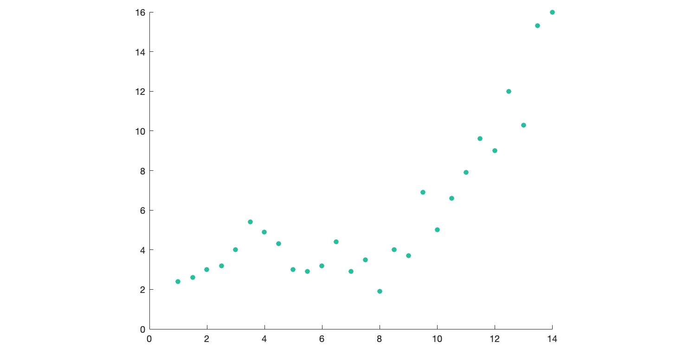
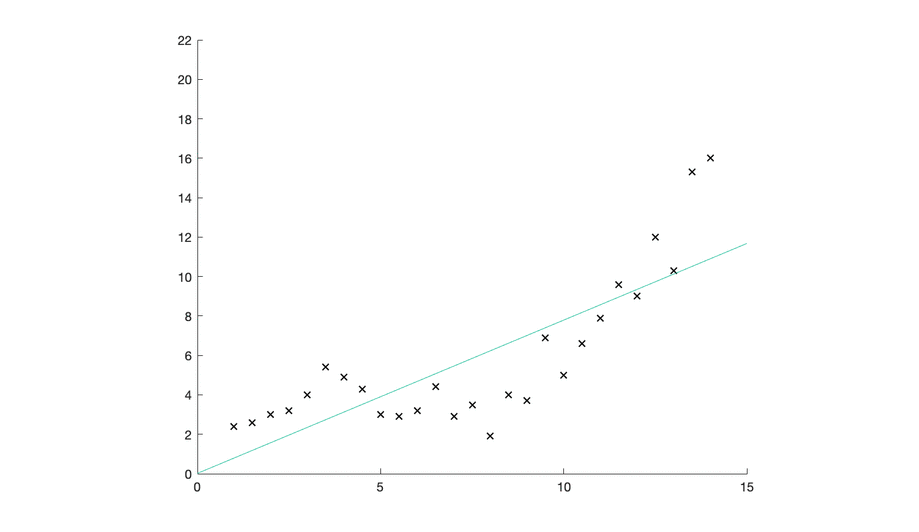

# polynomial-regression
Model generator based on the method of least squares.

## Usage
There is a unique entry-point, the ***createModel*** method.

Once we have created our model we can fit it by feeding it with data and specifying the desired degree/s of our resulting model/s.

The API is designed in a way that allows creating different models based on each degree at the same time. Instead of having a fixed estimation function, we have an internal object where we are going to store the corresponding coefficients for each degree. This way we can easily compare which degree suits best our problem by calling the estimate function specifying the different degrees.

Let's illustrate its usage with a simple example.
We are given these data points.
We have them stored as an array of [x,y] values:

We want to find a model that allows us to interpolate or estimate unknown values according to this information.
In this example, we are going to use a low degree (3) and a higher one (20).

The code would look as follows:
```javascript
const { createModel } = require('polynomial-regression');
const { data } = require('./example_dataset');

const model = createModel();

model.fit(data, [3,20]);

model.estimate(3,unknownXValue);
model.estimate(20,unknownXValue);

model.saveExpressions('./expressionsForGraphs.json');

```
The file saved looks like this:
```javascript
{
  "3": "+1.5062596662599177*x^0+1.425302045761659*x^1 ... "
  "20": "+66.40442892021944*x^0-204.3486735913864*x^1 ... "
}
```
And we can easily copy&paste those strings and plot the corresponding functions.

## API Reference
| Method  | Description | Arguments to be passed |
| ------------- | ------------- | ----------- |
| fit | Calculates coefficients for each degree provided and stores them internally | Data <Array<[x,y]>>, Degrees <Array<Number\>>  |
| estimate | Returns the estimated value | Degree \<Number\>, xValue \<Number\> |
| loadParams | Loads precalculated coefficients merging them into the current model internal store | Path \<string\> |
| saveParams | Save the current model coefficients in a JSON file | Path \<string\> |
| saveExpressions | Turn the current model coefficients into reusable expressions and save them in a JSON file | Path \<string\> |
